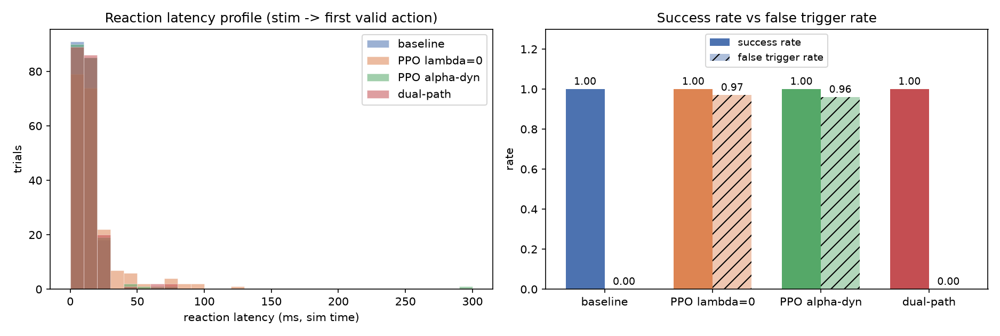
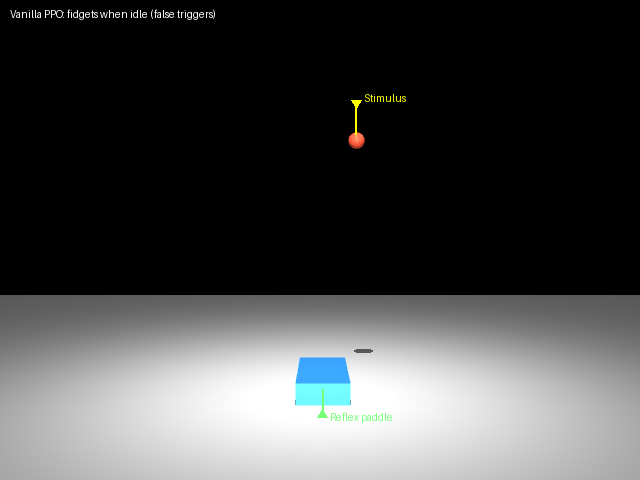
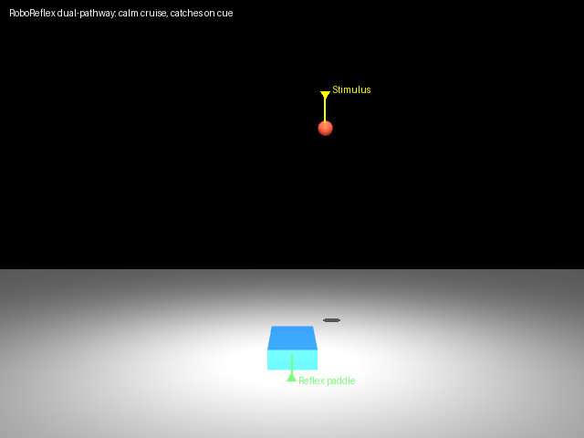

# RoboReflex (机映)

**RoboReflex: The foundation for robots to integrate into human life.**

In the fields of robotic low-level reflexes and stress responses, developers are still hand-writing throwaway scripts in general-purpose simulators, discarding them after a single run. There is no dedicated training environment, nor precise measurement tools.

RoboReflex aims to solve this. We turn reflexes into a first-class training target, focusing on: stimulus injection, latency-constrained training, and millisecond-level measurement.

Here are our three core strengths:

1. **Dual-pathway hard decoupling**: Fast reflexes and slow planning are strictly independent, with no weight sharing.
2. **Uniquely tailored latency metrics**: Provides p50/p95/p99 latency distributions and false trigger rate evaluation.
3. **Easy packaging**: Supports ONNX export for standalone deployment without platform lock-in.

## Experiments

Empirical data shows: while maintaining a 100% success rate, the dual-pathway architecture reduces the false trigger rate from 96%+ (PPO baselines) to 0%, while pushing valid reflex latency under 20ms.



## Comparison Demo

Left: vanilla RL (no latency constraint) — slow tail and constant fidgeting (false trigger rate 0.97).
Right: RoboReflex dual-pathway — cruises when safe, catches on stimulus (false trigger rate 0.00), latency tail 54ms→20ms.

| Vanilla RL | RoboReflex |
|---|---|
|  |  |

Four-group benchmark (handcrafted baseline / PPO λ=0 / PPO α-dynamic / RoboReflex dual-pathway):


## Quick Start

```bash
pip install -r requirements.txt
python src/demo.py --viewer          # interactive viewer
python src/demo.py                   # headless baseline stats
python -m src.reflex.train           # train a reflex policy
python -m src.bench.compare          # four-group benchmark
python -m src.bench.make_figures     # one-click paper figures
```

## Scenario as Config

A new scenario = a new YAML (see `src/scenarios/`). Built-in: ball catch (ball_catch_easy), dodge (dodge_easy).

## Platforms

Windows / Linux, pure pip install, no ROS dependency.

## Documentation

- Architecture & design: `docs/ARCHITECTURE.md`
- Adaptive reward (α-dynamic): `docs/REWARD.md`

## Disclaimer

We are currently in the prototype phase with no physical robots. All metrics are measured purely in simulation. If you'd like to join us, you're more than welcome!

---

# 机映 RoboReflex

**机映是机器人最终融入人类生活的基础。**

机器人“底层反射”、“应激”领域，至今仍在通用仿真器手写一次性脚本，用完就扔。没有专门的训练环境，也缺乏精准的测量工具。

“RoboReflex”（机映）旨在解决这一痛点。把“反射”变成一等训练对象。专注于：刺激注入、延迟约束，毫秒级测量。

我们有三项“硬货”：

1. **双通路硬解耦**：快反射与慢规划独立，权重不共享。
2. **特有延迟评测指标**：提供 p50/p95/p99 延迟分布及误触发生率评估。
3. **可“打包”**：支持 ONNX 格式导出，脱离平台可独立部署。

## 声明

项目为原型实验，"我们"没有真机，所有指标均在仿真环境下测得，如果"你"愿意加入"我们"，欢迎！

# License

Apache License 2.0 © 2026 WEIZHOGUO — see LICENSE file.
